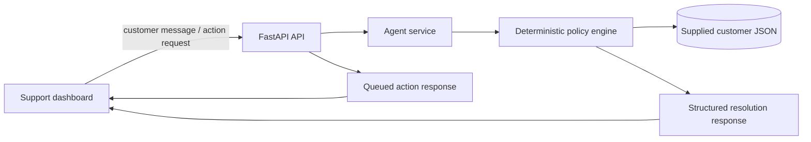

# AIONOS Customer Resolution Agent

## Problem

AIONOS is a customer-facing airline disruption resolution agent for airline support scenarios. The application is designed to work with three assignment-defined customer scenarios:

- Priya Nair (cancelled flight, refund or rebooking, unsupported upgrade request)
- Arvind Kulkarni (4-hour delay, meal voucher and lounge access, no hotel)
- Meher Kaur (6-hour delay, hotel only for delayed hours, fare difference escalation)

The product must behave like a professional airline support tool driven by deterministic policy evaluation instead of free-form hallucinated compensation.

## Features

- Customer switching across the three predefined travellers
- Policy-grounded resolution and explanatory responses
- Allowed actions and escalation guidance
- Audit trail for decisions and reason codes
- Structured chat flow for disruption questions
- Capacity to identify unsupported requests and escalate them clearly
- Backend + frontend architecture with local JSON-based customer data

## Architecture

React
 ↓
FastAPI
 ↓
Agent Service
 ├── Customer Data Loader
 ├── Policy Engine
 └── Action / Escalation Manager

## Policy Engine

The deterministic policy engine is the core guardrail. It evaluates flight disruption data against the supplied assignment business rules, including exact thresholds:

- Airline-caused cancellation: free rebooking within 24 hours or full refund
- Full refund returns to original payment method within 7 business days
- Delay under 3 hours: ₹500 meal voucher
- Delay over 3 hours: meal voucher + lounge access
- Delay over 5 hours: meal voucher + lounge access + hotel for delayed hours only
- Gold/Platinum: priority rebooking only, no extra compensation
- Fare difference above ₹1,500 requires supervisor approval
- Unsupported requests or legal complaints escalate to a human agent

The response layer does not rely on an LLM to grant permissions or invent compensation.

## Tech Stack

- Frontend: React + Vite
- Backend: FastAPI + Python
- Data: Local JSON in backend/app/data/customers.json
- Testing: Pytest

## Setup

From the repository root:

1. Create the backend virtual environment if needed.
2. Install backend dependencies:

   cd backend
   C:/Python313/python.exe -m pip install -r requirements.txt

3. Start the backend:

   cd backend
   C:/Python313/python.exe -m uvicorn app.main:app --reload --host 0.0.0.0 --port 8000

4. Start the frontend in a second terminal:

   cd frontend
   npm install
   npm run dev -- --host 0.0.0.0

5. Open the Vite frontend in the browser and begin with the customer selector.

### Vercel deployment

Deploy this repository as two Vercel projects:

- Frontend project root: `frontend`; build command `npm run build`; output directory `dist`; set `VITE_API_BASE_URL=https://<backend-project>.vercel.app`.
- Backend project root: `backend`; Vercel detects `api/index.py`; set `FRONTEND_ORIGIN=https://<frontend-project>.vercel.app`.

The backend entrypoint is `backend/api/index.py` and exposes the existing `app.main:app` application without duplicating routes or business logic.

## Environment Variables

Frontend configuration belongs in `frontend/.env.local` for local development or in the Vercel project settings for deployment:

```env
VITE_API_BASE_URL=http://localhost:8000
```

The backend accepts an optional `FRONTEND_ORIGIN` value to scope CORS. When it is unset, permissive CORS remains enabled for local development. Do not commit `.env` files or secrets.

## API Endpoints

- GET /api/health
- GET /api/customers
- GET /api/customers/{customer_id}
- GET /api/bookings/{pnr}
- GET /api/policies
- POST /api/chat
- POST /api/actions
- GET /api/resolutions/{id}

## Test Commands

Run the policy test suite:

cd backend
C:/Python313/python.exe -m pytest -q

Expected result: all assignment-specific policy tests pass. The frontend also supports `npm run lint` and `npm run build`.

## Demo Scenarios

1. Priya Nair: cancelled flight with refund request and unsupported business-class upgrade
2. Arvind Kulkarni: 4-hour delay asking for hotel accommodation
3. Meher Kaur: 6-hour delay, full-night hotel request, and ₹2,000 fare difference waiver request

## Design Decisions

- Assignment data is stored separately from business logic.
- The policy engine centralizes all business rules in one deterministic service.
- The UI presents clear outcomes: allowed, escalated, or not eligible.
- The backend intentionally never grants unsupported upgrades or compensation without policy support.
- Natural-language amounts are parsed only when the customer explicitly states a fare difference; a parsed amount above ₹1,500 creates a supervisor escalation and is never auto-waived.
- Action buttons create a queued request record only. The interface never claims a refund, rebooking, voucher, or escalation is completed by an external airline system.
- The audit timeline is session-based and records policy evaluations and action requests with current browser time.

## Architecture Diagram



The application is deliberately small: React owns the interaction state, FastAPI owns validation and transport, and the policy engine owns eligibility. There is no external LLM, database, payment processor, or airline integration in this assignment MVP.

## Runtime Validation

Verified locally with the documented commands:

- Backend health endpoint returned `{"status":"ok"}`.
- Priya: refund and rebooking were allowed; the business-class upgrade was escalated.
- Arvind: meal voucher and lounge access were allowed; hotel was not eligible at four hours.
- Meher: meal voucher, lounge access, and delayed-hours hotel were allowed; the ₹2,000 fare waiver was escalated because it exceeds ₹1,500 and was never allowed.
- Unknown customer requests returned HTTP 404; empty chat messages are rejected by request validation.
- Browser smoke test confirmed customer switching, demo scenario submission, resolution cards, loading state, and escalation audit creation.

## Limitations

- This implementation uses static assignment data and does not connect to an airline booking system or live LLM.
- It is intentionally deterministic and guardrailed to avoid policy hallucination.
- No real payment execution or external support escalation system is connected in this MVP.
